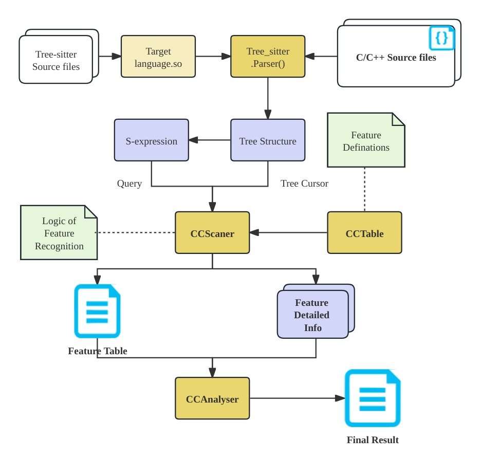

# An Empirical Study of Language features usage in C/C++

[TOC]


## Topic introduction

### Abstract

本项目旨在分析目标语言`C/C++`的各项语言特性和机制在开源项目中的使用情况。在实现中将目标特性划分为了$\text{Template \& Modular Programming}$ 、$\text{Concurrency \&Multithreading}$、$\text{Memory Management}$、$\text{Exception Handling}$、$\text{Polymorphism \& Overloading}$、$\text{Reference Control}$、$\text{Function}$、$\text{Type System}$等八个类别，并在每一类别中选取了相应的若干特征项；继而利用我们完成的工具`CCScaner`对一批开源项目仓库进行了统计分析，得到统计结果。本项目将基于这一统计结果进行进一步的分析与讨论，以加深对这一经典语言的诸多特性的理解；并与现有的基于其他高级语言特性的相关研究结论进行对照，从而在新的角度认识不同语言特性在实际应用中的作用。

### Target

1.  整理汇总`我们所关注的C/C++`语言特征，划分成为不同类别，并在每一类别中选取若干具有代表性的特征项

2.  基于我们完成的工具`CCScaner`分析`C/C++`的各项语言特征在开源项目中的使用情况，获得基础数据

3.  对得到的基础数据进行分析与讨论，关注：

    1.  `C/C++`语言中的那些特性具有比较显著的影响，并得到大量应用
    2.  不同领域语言使用者的特性使用倾向

    等等。

4.  与现有的基于其他高级语言特性的相关研究进行对照，进行进一步的讨论

## Design

>   这一部分不涉及具体实现，主要侧重功能预期

### Tools for generating trees

#### Tools we have explored

我们所考虑的工具均是`python`库的形式，即以`python`语言为基础，其原因是`python`具有脚本语言特有的便捷性，此外对于数据的分析与处理也具有很好的支持。

-   `pycparser`

    `pycparser`可将`C`语言代码解析为`AST`，可以作为`C`编译器或者其他分析工具的前端。

    -   只支持`C`语言

-   `pygccxml`

    基于`GCC-XML`，后者后来被`Castxml`所替代。其目的是从`GCC`的内部表示生成 C++ 程序的 XML 描述。并且由于 XML 易于解析，因此其他开发工具将能够与 C++ 程序一起使用，而无需复杂的 C++ 解析器的负担。

    -   支持的版本落后，`c++98`能够全面支持，但`c++11`与`c++14`只能做到运行通过测试，更新的版本甚至未经过测试

-   `lib-clang`

    基于`C`语言的`libclang`，后者又基于` clang`。`libclang`是`clang`的稳定的高级 C 接口。

然而以上工具普遍存在以下缺点：

1.  支持的语言或者版本有较大限制
2.  容错性不好，对于稍不符合要求的语法（比如新版本加入的特性）就完全无法运行
3.  头文件展开会导致代码中加入大量库文件内容，影响分析
4.  运行速度慢，难以在合理的时间内对大规模的仓库展开统计
5.  如欲对仓库展开分析，需要引入预编译过程，可能需要自己调配编译参数

所以，我们希望能够找到一个容错性好、不引入大量库文件内容、运行速度快、不涉及直接操作仓库过程的语言分析工具。

#### Why Tree-sitter?

>   Tree-sitter 是一个解析器生成器工具和增量解析库。 它可以为源文件构建具体的语法树，并在源文件编辑时有效地更新语法树。

基于探索部分寻找到的工具的种种缺陷，以及前述的诉求，我们最终找到了一个新的替代工具，即 [`Tree-sitter`](https://tree-sitter.github.io/tree-sitter/) 。此工具具有如下优点：

-   普适性好：虽然在此次实验中我们所完成的是`CCScaner`，但只要在相同的框架下简单更改项目核心文件`ccscaner.py`中的树访问逻辑与`cctable.py`中的特征表条目，就可以轻松移植成为`RustScaner`、`GoScaner`、`HaskellScaner`、`MyLanScaner`等等。

    >   这里选用`CCScaner`的原因是在探索过程中我们还不确定方案的可行性，所以选择了一个大家相对较熟悉的语言作为分析对象

-   分析快捷：结合`query`查询与`cursor`的方式可以实现目标信息的快速提取，因而有能力对较大型的仓库进行分析

-   鲁棒性好：容错性极佳，对于任何文件均可以流畅运行，对于语法错误或者不支持的语法只会造成`ERROR`结点并在分析时被忽略，不会因为少数的语法问题造成整个仓库的分析无法运行。

-   依赖项少：只需要编译生成一个针对目标语言的动态链接库，并在`python`中安装对应库即可运行。

-   不引入预编译过程：不会由于头文件展开导致代码中加入大量库文件内容；不需要针对仓库单独配置编译参数。

然而上述优点部分是建立在如下的牺牲上的：

-   `Tree-sitter`是一个词法分析器，生成的结果是`CST`而非`AST`，因而造成：
    -   缺乏一些重要的语义信息，比如类型标注，继而造成识别能力有限
    -   由于缺乏预编译过程，在不引入库文件内容的同时也造成存在于代码中的宏无法展开
    -   由于`C/C++`的宏展开替换过于灵活，对于某些宏在应用中的特殊情形容易误识别造成统计的偏差

因而需要在`Tree-sitter`与`pygccxml/lib-clang`两类工具中进行权衡。最后综合以下考虑，我们选择使用`Tree-sitter`作为主要的分析工具：

-   目标语言`C/C++`相对来说很多特性可以通过关键字或者局部词法信息判断
-   为了在给定时间内分析达到满足统计要求的数据量，需要选择性能相对较优秀的分析工具
-   尽量减少人为对目标仓库的操作，比如配置编译参数，因为不同的编译参数经过预编译后对应不同的代码，其特性分布也有所不同
-   目标仓库列表中包含跨越多个`C/C++`版本的语法，而工具即使是最新版本，其覆盖范围仍是有限的，因而要求必须具有一定的容错能力

既然已经选用`Tree-sitter`，针对前述的种种缺陷，需要对选择的特征项进行一定约束，规则如下：

-   目标特征项一定是在词法上可以区分的

-   并且这种区分是局部性的，即不可跨越多个文件，这基于两个方面的考虑：

    -   目标仓库内容繁多，`ccscaner`的处理是面向单个文件的，过程中会记录大量信息并存储，可能产生大量文件，如果对这些文件进行综合分析，时间开销比较大
    -   跨越多个文件的处理有时可能会在信息上相互依赖并利用到一些语义信息进行区分，这是工具所不能够支持的

-   特征尽量不易受宏展开以及`typedef`等操作对词法分析带来的影响；比如一些仓库中常常将一些基本数据类型定义为其他符合使用情境的名称，宏定义函数也易于与真正的函数调用混淆等等。

    >   这一点不能够完全保证，因为从词法和语法上来说很多特征的识别都能够受到宏展开的影响。但要注意，分析过程中目标仓库往往代码比较规范，一些极端特殊、人们一般不会使用的情形并不会涉及。所以，只要对测试仓库在分析结束后将分析过程记录的具体信息条目索引到源代码进行比对并确认是否识别错误，如果识别不准确在根据错误原因对特征的选取与识别逻辑进行调整，直到在抽取的数据中鲜少出现识别错误的情况，就可以认为特性的识别是相对准确的。


### `C/C++` Features

>   特征表格

|            Category            |        Language Features        |                    iIllustration/Utility                     | Reference denominator可参考分母 |
| :----------------------------: | :-----------------------------: | :----------------------------------------------------------: | :-----------------------------: |
| Template & Modular Programming | Standard Template Library (STL) |  容器（Containers）:stack、vector、set、map、priority_queue  |             文件数              |
|                                |          template 范式          |         泛型编程：创建适用不同数据类型的泛型函数和类         |           函数定义数            |
|                                |          lambda表达式           |        构造闭包：能够捕获作用域中的变量的无名函数对象        |         代码行数取对数          |
|                                |         using namespace         |                         命名空间控制                         |             文件数              |
|                                |        Macro宏中的##拼接        |         避免命名冲突，更灵活地生成代码，但容易出bug          |            宏定义数             |
|  Concurrency &Multithreading   |          thread_local           |                     变量声明为线程存储期                     |        变量定义数取对数         |
|                                |            votatile             |            多任务共享变量、多线程并发访问变量修饰            |        变量定义数取对数         |
|       Memory Management        |        析构函数~function        | 当一个对象被删除或离开其作用域时，会自动调用其析构函数进行资源回收 |            类定义数             |
|                                |         Smart Pointers          | shared_ptr/unique_ptr/weak_ptr<br>(通过指针释放对象可能造成内存泄漏) |        变量定义数取对数         |
|                                |   直接初始化:T 对象 ( 实参 )    |      从明确的构造函数实参的集合初始化对象，无需右值复制      |        变量定义数取对数         |
|       Exception Handling       |        Try-Catch Blocks         |   catch 语句捕捉 try 块中抛出的特性异常（std::exception）    |         代码行数取对数          |
|                                |         noexcept 说明符         | noexcept 是一个函数后缀，指示该函数是否可能抛出异常，减少不必要的异常处理开销 |           函数定义数            |
|   Polymorphism & Overloading   |          Nested Class           |                  支持嵌套类、不支持嵌套函数                  |            类定义数             |
|                                |      Operator Overloading       |                          运算符重载                          |           函数定义数            |
|                                |     virtual&override&final      | override 指定一个虚函数覆盖另一个虚函数<br>final指定某个虚函数不能在派生类中被覆盖，或者某个类不能被派生 |           函数定义数            |
|                                |   Polymorphic Type Conversion   |             dynamic_cast/static_cast/const_cast              |        变量定义数取对数         |
|                                |      function overloading       |               同名不同参数个数或类型的函数声明               |           函数定义数            |
|       Reference Control        |              using              |                   跨类或跨空间引用成员对象                   |        变量定义数取对数         |
|                                |              this               | this指针指向隐式对象形参（在其上调用非静态成员函数的对象）的地址 |            类定义数             |
|                                |         friend友元声明          |            允许类的非公有成员被一个类或者函数访问            |           函数定义数            |
|            Function            |            可变参数             | int main (int argc, char \*argv[ ]) { 函数体 }<br>变长实参（...） |           函数定义数            |
|          Type System           |             typedef             |            允许用户自定义类型别名，增强代码可读性            |             文件数              |
|                                |              union              |                   共用体类型提高内存利用率                   |             文件数              |
|                                |            decltype             |            泛型编程：创建模板时易于获得表达式类型            |           函数定义数            |
|                                |              using              |                 创建类型别名，增加代码可读性                 |        变量定义数取对数         |
|                                |            votatile             | 提醒编译器该变量易变，无需优化，系统总是重新从它所在的内存读取数据 |        变量定义数取对数         |
|                                |            constexpr            |    指定变量或函数的值可以在常量表达式中出现，减少重复计算    |        变量定义数取对数         |
>   是否需要有说明？


### Data set

>   仓库数据集的选取

>   按照类别划分，之后也做一个表格

### Data analysis

>   希望得到数据之后按照何种方式进行分析

>   待定

### CCScaner

>   预期功能介绍

在分析目标、分析方式、分析工具悉数确定之后，就可以着手构建实现目标的代码框架。

#### Expected functionality

一些期望达成的主要功能：

1.  树分析：对目标文件生成分析树并针对目标特征表项进行树访问提取出目标特征。
2.  数据获取与存储：记录各个文件中各个目标特征出现的次数并累加，并记录其所在仓库名、文件路径、行列位置与局部字节串信息以便于索引。具体存储格式在`doc/storage-format.md`中有具体说明。

#### Project structure




#### Analysis methods

##### Query


##### Tree cursor


### Technical route

>   开发路线（时间线）
>
>   之后再细化一下

1.  明确目标语言
2.  讨论语言特性，选择关注点并进行汇总
3.  建立`CCScaner`的项目框架，选择树分析工具，完成外层数据处理脚本
4.  确定数据处理与存储流程，完成对特性表类`cctable`的搭建
5.  基于特性汇总表完成对`demo/`目录的填充，将特征的定义细化到语言实例
6.  完成`CCScaner`项目核心类`ccscaner`，确定对每一个特性项的处理逻辑
7.  分别对单文件和单目录进行调试测试，据此完善项目的每一个组件
8.  对测试仓库进行处理，得到相应数据，从而对特性表、特性处理方法进行反复的再调整
9.  利用已完善的工具`CCScaner`对大量仓库进行分析汇总
10.  对数据进行处理与人工分析，得到初步结论
11.  与现有的相关研究进行对照，进行深入讨论


## Division of labor & Contribution ratio

| Student ID | Name   | Github id                                   | Work content |
| ---------- | ------ | ------------------------------------------- | ------------ |
| PB21061327 | 王志成 | [Starrybook](https://github.com/Starrybook) |              |
| PB21111656 | 余淼   | [Ymm-cll](https://github.com/Ymm-cll)       |              |
| PB21111682 | 龚劲铭 | [Gjmustc](https://github.com/Gjmustc)       |              |

## Implementation

### Inner structure of CCScaner
```bash
~/Documents/ccscaner$ tree
.
├── README.md						: 仓库介绍
├── 05-language-features-usage-in-Cpp.md	: 小组工作介绍
├── build							: 从 tree-sitter 源码编译出针对目标语言的动态链接库
│   └── my-languages.so				: 可为任意语言，本项目中为 c/c++
├── doc								: 文档
│   ├── binding.pyi					: tree-sitter 的 python 绑定
│   ├── Cppfeatures.md				: c/c++ 目标特性表，即本项目分析目标
│   ├── grammar.js					:
│   ├── Report.md					: 报告【当前文件】
│   ├── scripts-examples.md			: 执行脚本的使用示例与相关说明
│   ├── scripts.md					: 脚本的接口说明
│   ├── sources.md					: tree-sitter 官方文档等参考信息
│   └── storage-format.md			: 数据存储格式的统一定义
├── demo							: 测试文件，实质上是对抽象特征表条目的具象化描述
│   ├── FEATURE-CLASS				: 特征大类
│   │   ├── ......					: 大类下的具体条目
│   │   └── feature-item.cpp
│   └── ......						: 其他特征大类
├── data							: 最终分析结果原始数据的存放位置
│   ├── feature-tables				: 目标仓库的特征统计表
│   │   ├── ......					: 以仓库名标识的特征统计表
│   │   └── repo-name.csv
│   ├── ......						: 每个仓库的具体信息条目做成压缩包的形式存放于此
│   └── repo-name-res.zip
├── res								: 程序运行时的分析结果存放处，是运行时维护的共享区域
│   ├── feature-tables				: 目标目录/文件的特征表存放处
│   │   ├── ......					: 以目录/文件名称命名的特征统计表文件
│   │   └── repo-name.csv
│   └── repos-info					: 目录/文件具体信息条目存放处
│       ├── ......					: 按照 特征大类-特征具体条目 标识的 csv 文件
│       └── FEATURECLASS_featureItem.csv
├── ccanalyser.py					: 基于 ccscaner 的结果进行综合分析，设计时预留了接口，但最后并未启用
├── ccscaner.py						: 项目核心，包含对每一个特征条目的处理逻辑，依赖于 cc
├── cctable.py						: 项目核心，定义了特征表的数据结构，并承担存储部分的工作
├── ccprinter.py					: 实现分析树可视化，辅助调试
├── test-file.sh					: 对单个指定的文件进行分析，多用于调试，也作为 test-dir 的子过程
├── test-dir.sh						: 对目录下的所有符合后缀要求的文件进行分析，依赖于 test-file
└── clean-all.sh					: 清除 ./res/ 下的分析产出
```


### How to analyze a repository?


## Data & Analysis

### Raw data

>   对不同仓库统计出来的原始数据

### Analysis

>   对数据分析的部分，可能会有多个子项


## Conclusion


## Reference