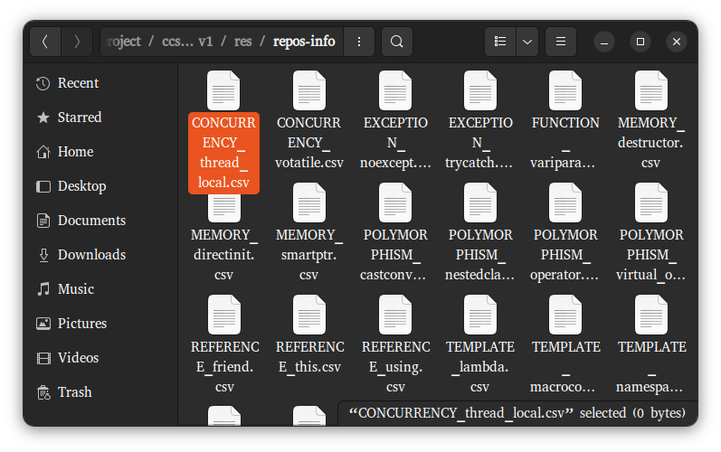
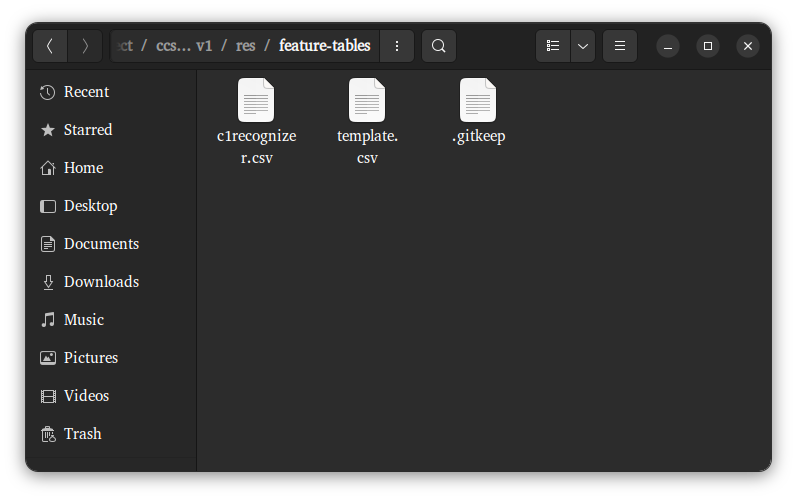
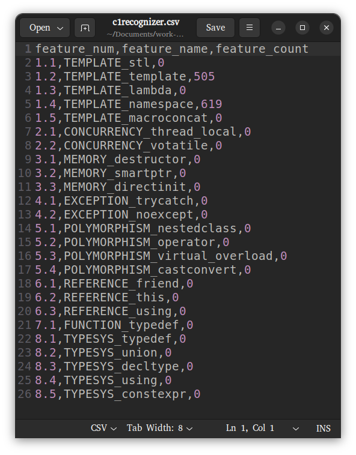
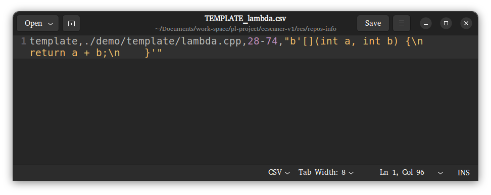

## Usage of scripts (examples)

### ccscaner.py

```bash
$ python3 ccscaner.py ./demo/template/template.cpp true ./res/feature-tables/template.csv ./res/repos-info/
```

-   目标文件为`./demo/template/template.cpp`
-   指定调试状态为`true`
-   指定特征标存储路径为`./res/feature-tables/template.csv`
-   指定具体信息存储目录为`./res/repos-info/`

注意：

-   `./res/feature-tables/template.csv`要事先存在，不然不会处理
-   `./res/repos-info/`下各个特征文件要预先创建好，不然会报错
-   后两个参数如果不指定或者指定的位置不存在则视为无效参数，不会i执行相应操作；但注意位置一定要对齐，即第四个参数之前一定要已经填充了三个参数

输出大概这个样子：

```bash
>---------------------------------------------------------------------------
In find_TEMPLATE_template, captures: 
	└── template_declaration  :  template_declaration
In find_TEMPLATE_lambda, captures: 
In find_TEMPLATE_namespace, captures: 
---------------------------------------------------------------------------<
>---------------------------------------------------------------------------
feature_table:
+ TEMPLATE :
	└── stl :
	└── template :
		└── ('0-69', b'template <typename T>\nT max(T a, T b) {\n    return (a > b) ? a : b;\n}')
	└── lambda :
	└── namespace :
	└── macroconcat :
+ CONCURRENCY :
	└── thread_local :
	......（省略）
---------------------------------------------------------------------------<
>---------------------------------------------------------------------------
In FeatureTable.store_csv(), table_frame_now:
   feature_num                   feature_name  feature_count
0          1.1                   TEMPLATE_stl              0
1          1.2              TEMPLATE_template              1
2          1.3                TEMPLATE_lambda              0
3          1.4             TEMPLATE_namespace              0
......（省略）
---------------------------------------------------------------------------<
>---------------------------------------------------------------------------
In FeatureTable.store_csv(), table_frame_new:
    feature_num                   feature_name  feature_count
0           1.1                   TEMPLATE_stl              0
1           1.2              TEMPLATE_template              8
2           1.3                TEMPLATE_lambda              7
3           1.4             TEMPLATE_namespace              7
......（省略）
---------------------------------------------------------------------------<
```

第一部分是执行是信息，即`find`函数输出的调试信息，可以看到当前只有三个函数；第二部分是包含详细信息的特征表，也就是经过所有`find`函数处理过后的`cctable`；第三部分是当前的特征计数表，可以看到对`TEMPLATE_template`计数了一次；第四部分是更新过后的计数表，即将当前计数表与原来存储在`./res/feature-tables/template.csv`处的计数表相加得到的计数表，最后存入`./res/feature-tables/template.csv`中。这里为方便显示省略了一些内容。

### test-file.sh

```bash
./test-file.sh -n -c default -d -f ./demo/template/template.cpp
```

-   `-n`指定不进入调试状态
-   `-c`指定csv特征计数表存储位置，如果是`default`则存在`./res/feature-tables/template.csv`中，这里的`template`来自`template.cpp`，为自动生成；如果指定一个名字比如`repo-name`，则存在`./res/feature-tables/reop-name.csv`中。文件不存在的话会创建
-   `-d`指定要写入具体信息，位置默认为`./res/repos-info`，文件不存在的话脚本**不会**创建（开销比较大）
-   `-f ./demo/template/template.cpp`指定目标文件

这样的话输出就只有一个`Done.`。


如果指定进入调试模式：

```
./test-file.sh -c default -d -f ./demo/template/template.cpp
```

则会得到和前面一部分的介绍中一致的调试信息（本来`test-file.sh`也就是对`ccscaner.sh`的封装）。


### test-dir.sh

```bash
./test-dir.sh -n -c -d -r ./demo/template/
```

-   `-n`指定不进入调试模式，否则输出过于冗长
-   `-c`指定要存储特征计数表，位置默认为`./res/feature-tables/dir-name.csv`，这里`dir-name`就是后面的`template`
-   `-d`指定要记录具体信息，位置默认为`./res/repos-info`，文件不存在的话脚本会创建
-   `-r`指定目标目录，如果要分析仓库就将其换为仓库的路径


输出大概这个样子：

```bash
Creating feature table at ./res/feature-tables/template.csv
Creating detailed info at ./res/repos-info/
Processing ./demo/template/namespace.cpp, (with 4 files left)
./test-file.sh -n -c template -d -f ./demo/template/namespace.cpp
Done.
Processing ./demo/template/template.cpp, (with 3 files left)
./test-file.sh -n -c template -d -f ./demo/template/template.cpp
Done.
Processing ./demo/template/lambda.cpp, (with 2 files left)
./test-file.sh -n -c template -d -f ./demo/template/lambda.cpp
Done.
Processing ./demo/template/stl.cpp, (with 1 files left)
./test-file.sh -n -c template -d -f ./demo/template/stl.cpp
Done.
Processing ./demo/template/macroconcat.cpp, (with 0 files left)
./test-file.sh -n -c template -d -f ./demo/template/macroconcat.cpp
Done.
```

其中调用了`test-file.sh`，同时会显示进度。


### Csv files

正常运行一次`test-dir.sh`之后`./res/repos-info/`下会出现这些文件：



命名方式与`cctable`中的名称定义一致，也与`demo`的目录组织一致。


而如果指定存储`csv`文件的话，运行完`ccscaner.py / test-file.sh / test-dir.sh`之后`./res/feature-tables/`下会出现相应的文件/目录名对应的`csv`文件，其中的内容是目标文件/目录的特征计数表：



比如这里，我之前对`PW5`实验仓库运行了`test-dir.sh`，结果存在`c1recognizer.csv`中，如下：



由于大量`find`函数还未完成，所以很多表项为0。

同样地，另一个`template.csv`是用`test-file.sh`对`./demo/template/template.cpp`运行的结果。

具体信息的存储方式大概这个样子：



其中这一行第一部分是仓库名或者文件名（如果是运行`test-file`的话）；第二部分是相对路径（绝对路径会比较长），对应于传入的命令行参数；第三部分是位置，这里由于`query`处理时处理对象是字节流而不是树节点（包含行号信息），所以这里用`query`的方式只能够标示出内容的字节流起止位置，无法定位行号，之后再找一下有没有其他方式；第四部分是具体信息的内容，可以灵活处理，像这里放出全部定义内容就不合适。